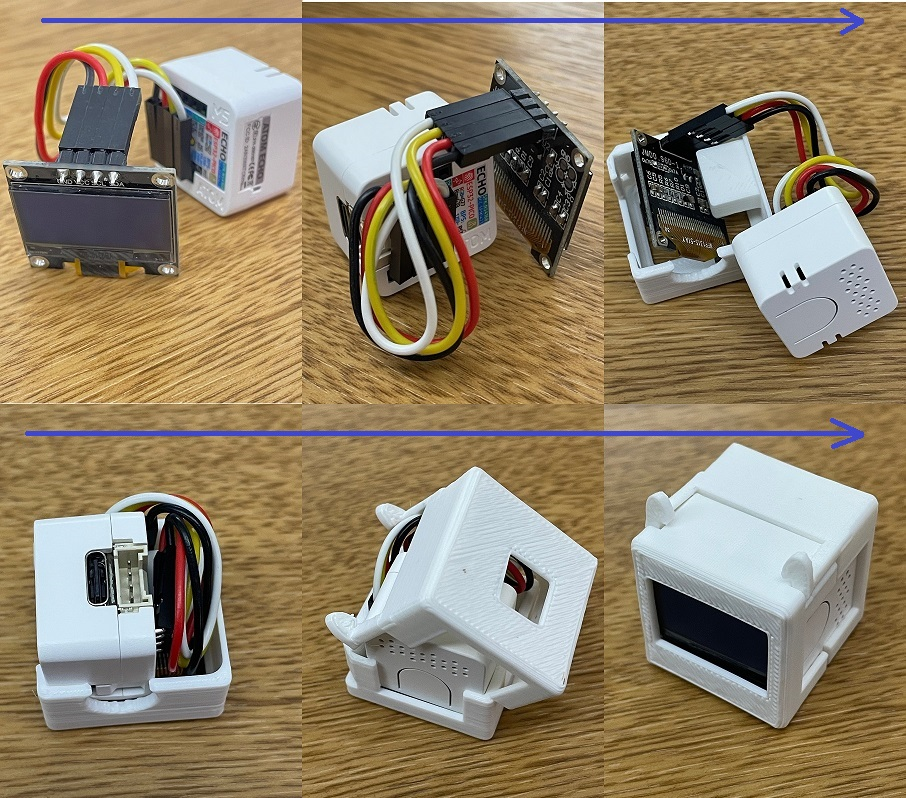
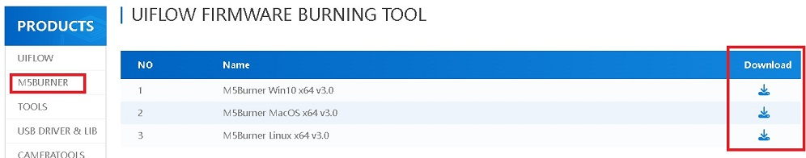
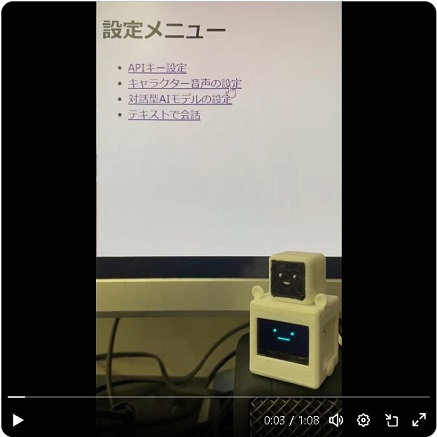

# AI_StackChan_Minimal
AIスタックチャン - ミニマル(Minimal)です。robo8080さんの[AIｽﾀｯｸﾁｬﾝ2](https://github.com/robo8080/AI_StackChan2)および[ATOM Echo移植版](https://github.com/robo8080/M5Unified_AtomEcho_ChatGPT)をベースに<B>【誰でも気軽に遊べるような"おもちゃのｽﾀｯｸﾁｬﾝ"】</B>を目指しています(サーボ動作,ウェイクワード等除く)。「プログラムやIoTの勉強は、興味が出たら始める」でOKです！
  

 

特徴 
- 誰でも勢いで始められるよう「おもちゃ感覚で使えるミニマル構成」にリ・デザイン
	- 買いやすい価格：3,000円台
	- 作りやすい構成：プログラム環境無しでもインストール可。ハードは「ワイヤーとはめ込み」のみ(はんだ付け不要)
	- 操作しやすいUI：無線でWifi/APIキー設定(プログラム/SDカードへの記載不要)。またAIモデル/キャラクター音声の変更,音声入力以外にもテキストで質問が可能
- 使用Webサービスと利用料金(低価格モデルを使えば、ほぼ料金が発生しませんが、ご注意ください)
	- 対話型生成AI： [ChatGPT](https://platform.openai.com/docs/overview)
		- [料金 - GPT-3.5 Turbo/4o](https://openai.com/api/pricing/)
	- 音声合成：[Web版 VOICEVOX（高速）](https://voicevox.su-shiki.com/su-shikiapis/)
		- 料金 - 無料(個人利用を想定)
		- 参考 - VOICEVOX：[キャラクター一覧](https://voicevox.hiroshiba.jp/)
		- クレジット表記 - VOICEVOX:ずんだもん,VOICEVOX:四国めたん,VOICEVOX:青山龍星,VOICEVOX:WhiteCUL
	- 音声認識：[OpenAI Whisper](https://openai.com/api/pricing/) もしくは [Google Cloud STT](https://cloud.google.com/speech-to-text?hl=ja) のどちらかを選択
		- [料金 - Audio models: Whisper](https://openai.com/api/pricing/)
		- [料金 - Speech-to-Text V1 API](https://cloud.google.com/speech-to-text/pricing?hl=ja)
 

感謝 
- まずは命を削ってAIスタックチャンを公開してくれた、robo8080さんに大大感謝いたします。 
- AIスタックチャン誕生を支えてくださったコミュニティの皆様に感謝！(作画:みすじさん) 
	- 
- Google Cloud STTは、”MhageGH”さんの [esp32_CloudSpeech](https://github.com/MhageGH/esp32_CloudSpeech/ "Title") を参考にさせて頂きました。ありがとうございました。 
- OpenAI Whisperが使えるようにするにあたって、多大なご助言を頂いた”イナバ”さん、”kobatan”さんに感謝致します。 
---

### AIスタックチャン - ミニマルを作るのに必要な物、及び作り方(※価格：2024/06/14時点) ###
Atom Echoだけでも動作します！が、以下のモノを組立てることで【より可愛いミニマル】に仕上がります 
-  ATOM Echo(マイコン本体)[約2,000から2,500円]
	- プログラムを動作させる本体。ディスプレイにつなぐと顔と文字でコミュニケーションができます
	- <B>注意：スピーカーが超小型のため、小さい音量/単位時間でお使いください。</B>会話は問題ありませんが音楽再生には向いていません
		- <a href="https://www.mouser.jp/ProductDetail/M5Stack/C008-C?qs=81r%252BiQLm7BQ%2FzW%2Fdq5IHnA%3D%3D" target="_blank">マウザー：2,066円</a>
		- [DigiKey：2,220円](https://www.digikey.jp/ja/products/detail/m5stack-technology-co-ltd/C008-C/12174736)
		- [スイッチサイエンス：2,475円](https://www.switch-science.com/products/6347)
-  有機ELディスプレイ(0.96インチ 128×64ドット)[約600円]
	- SSD1306を搭載したもの。4本のワイヤーで本体につなぎます(I2C接続)
	- <B>注意：多様なサイズがあるため、外装ケースに入る <B>サイズ：幅：25.2mm x 高さ：26mm</B>か、ご確認ください
		- <a href="https://akizukidenshi.com/catalog/g/g115870" target="_blank">秋月電子通商：580円</a>
- ジャンパーワイヤ[メス-オス）（10cm）[約700円]
	- ATOM Echoと有機ELディスプレイを接続するのに使用します。外装に入る短いワイヤーをお使いください
		- <a href="https://www.amazon.co.jp/dp/B072N2WR5N/" target="_blank">アマゾンジャパン：699円</a>
- 外装ケース
	- このページで3Dモデルを無料公開しています。印刷してお使いください。印刷済ケース販売も検討中
		- [3D_model：無料](https://github.com/A-Uta/AI_StackChan_Minimal/tree/main/AI_StackChan_Minimal/3D_model )
			- [使い方] front.stlとback.stlの1組がセット。印刷後にはめ込みます。
			- [2024/06/10] v02のモデルを追加しました

### ハード制作の流れ(イメージ) ###
 0. ジャンパーワイヤを、ラジオペンチ（無ければピンセットでも可）で、90度に折り曲げます
 1. ジャンパーワイヤを、[ATOM ECHO](https://docs.m5stack.com/ja/atom/atomecho "Title")と有機ELディスプレイに、以下の対応で接続します 
  
 2. ジャンパーワイヤを、図のように巻きます
 3. ディスプレイから3DModelのfrontに差し込みます
 4. ATOM Echoを図のように頭からfrontに差し込み、ワイヤーは右下の空きスペースに押込みます
 5. 3DModelのBackを後ろから被せ、耳の取っ掛かりでパチッと締めます
 6. 完成です
  
- 1連の流れ(画像クリックで動画に飛びます) 

---

### 各Webサービス APIキーの取得 ###
- OpenAI API（ChatGPTおよびWhisper）
	- [参考：OpenAI APIキーの取得/登録方法](https://nicecamera.kidsplates.jp/help/6648/)
	- [OpenAIのウェブサイト](https://openai.com/)にアクセスして、アカウントを作成します。メールアドレスと携帯電話番号が必要です
	- アカウント作成後、APIキーを発行します。APIキーは有料ですが、無料期間やクレジットがあります
- Web版 VOICEVOX 
	- [WEB版VOICEVOX API（高速）](https://voicevox.su-shiki.com/su-shikiapis/)の「こちらでapiKeyを生成してください」から取得できます
	- <B>注意：無料サービスのため、込み合っている時間には音声再生が途切れることがあります</B>
	- 最新の話者ID一覧(注意：ハミングは未対応) https://www.voicevox.su-shiki.com/voicevox-id
- Google Cloud Speech to Text
	- <B>注意：音声認識にWhisperを使うときは不要です</B>
	- [参考：Google Cloud STT（音声認識）のAPIキーの作り方](https://scrapbox.io/stack-chan/Google_Cloud_STT%EF%BC%88%E9%9F%B3%E5%A3%B0%E8%AA%8D%E8%AD%98%EF%BC%89%E3%81%AEAPI%E3%82%AD%E3%83%BC%E3%81%AE%E4%BD%9C%E3%82%8A%E6%96%B9)
	- [参考：Google音声認識APIとは？特徴や料金プラン、使い方を画像付きで徹底解説！](https://www.notta.ai/blog/how-to-use-google-speech-to-text-api)
	- [Google Cloud Platformのウェブサイト](https://cloud.google.com/?hl=ja/)にアクセスして、アカウントを作成します。メールアドレスと携帯電話番号が必要です。カードの登録が必須ですが、無料トライアルや無料枠があります
	- アカウント作成後、APIキーを取得します
	- APIキーでSpeech to Textを有効にするのを忘れないで下さい
---

### ソフト：インストールの流れ(ツール：M5 Burnerで実施。プログラム環境不要) ###
1. M5Stack社のページより、自身のPC環境にあったM5BurnerをDownloadします(画像クリックでサイトへ飛びます) 

2. (この画像はWindows版)Downloadしたファイルを解凍し、M5Burner.exeを実行します 
[

3. メッセージが出るので、詳細を押してから実行ボタンを押して起動します 
[

4. 左メニューの「ATOM」を選択し「Stackchan-AIｽﾀｯｸﾁｬﾝ-ﾐﾆﾏﾙ(Minimal)」のDownloadボタンを押します。Download成功後、Brunボタンを押し、Continueを押します 
[

5. Startボタンを押してインストール(ファームウェア書込み)を開始し、「Burn successfully, click here to return」が表位されたら完了です 
[

- [参考ページ：M5Burner v3の使いかた(さいとうてつや様)](https://zenn.dev/saitotetsuya/articles/m5stack_m5burner_v3) 
---

### ソフト：プログラムでビルド＆インストールする際に必要な物 ###
- [ATOM ECHO](https://docs.m5stack.com/ja/atom/atomecho "Title") 
- VSCode 
- PlatformIO 
	- [参考：電子工作素人によるスタックチャン製作記６（Platform IO 環境構築編）](https://note.com/ku_nel_5/n/n5bbdd5e176bf)

※使用しているライブラリ等は"platformio.ini"を参照してください。ただし文字表示をスクロールするために、Avatarライブラリをlibフォルダにコピーして変更を加えています（platformio.iniではロードしない） 

---

### 使い方(画像クリックで動画に飛びます) ###
1. プログラムをビルドまたはソフトをインストール後、Wifi接続をスマホアプリ: Esp touch※から設定 

	- [参考：Esp touch：Seeed Studio XIAO ESP32C3 SmartConfigでスマートフォンからWi-Fiを設定](https://lab.seeed.co.jp/entry/2022/10/17/120000)
	- <B>注意：ESPTouchを選択してください。"ESPTouch v2はESP32C3専用"です</B>
	- <B>注意：Esp touchの接続先WiFiは"2.4GHz"にしてください。5GHzではAtom Echoが見つかりません</B>
		- [参考：M5StickC(ESP32)での無線通信方式の選び方](https://lang-ship.com/blog/work/m5stickc-esp32-radio/)
	

2. 各種 APIキーをWebブラウザから設定 

3. 1クリックで"おしゃべり"、ダブルクリックで"設定状態の表示"で遊ぶことができます 

4. 設定メニューから"キャラクター音声","対話型AIモデル"を変更可能。また"テキストで会話"で長文の会話もできます 

---

### よくあるご質問 ###
Q.キャラクターがしゃべらない/音声が途切れる 
A.VoiceVoxのAPIキーが設定されていない可能性があります。ブラウザの設定メニューよりAPIキーを設定ください 

 
 
 