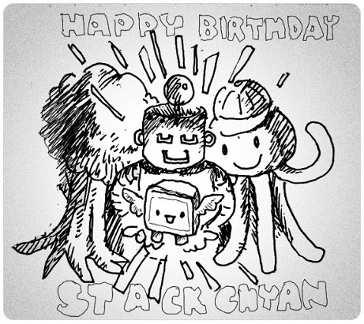
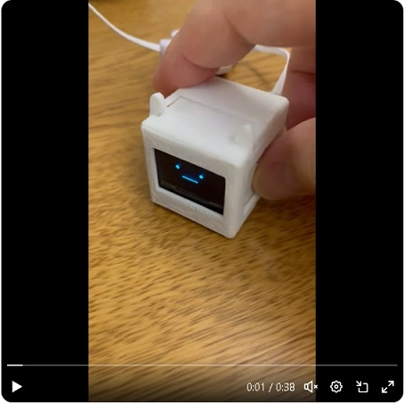

# AI_StackChan_Minimal
AIスタックチャン - ミニマル(Minimal)です。robo8080さんの"AIｽﾀｯｸﾁｬﾝ2"および"ATOM Echo版"をベースに、必要最低限の機能を搭載しました(サーボ動作,ウェイクワード等除く)
  

 

特徴 
- 誰でも勢いで始められるよう「おもちゃ感覚で使えるミニマル構成」にリ・デザイン
	- 買いやすい価格：3,000円台
	- 作りやすい構成：M5 Burnerでプログラム無しでもインストール可。またワイヤーとはめ込みのみ(特別な工具・はんだ付け不要)
	- 操作しやすいUI：無線でWifi/APIキー等が設定できます(プログラムおよびSDカードへの記載が不要)
- 使用Webサービスと利用料金(低価格モデルを使えば、ほぼ料金が発生しませんが、ご注意ください)
	- 対話型生成AI： [ChatGPT](https://platform.openai.com/docs/overview)
		- [料金 - GPT-XXX](https://openai.com/api/pricing/)
	- 音声合成：[Web版 VOICEVOX](https://voicevox.su-shiki.com/su-shikiapis/)
		- [料金 - 無料(個人利用を想定)]
	- 音声認識：[OpenAI Whisper](https://openai.com/api/pricing/) もしくは [Google Cloud STT](https://cloud.google.com/speech-to-text?hl=ja) のどちらかを選択
		- [料金 - Audio models: Whisper](https://openai.com/api/pricing/)
		- [料金 - Speech-to-Text V1 API](https://cloud.google.com/speech-to-text/pricing?hl=ja)
 

感謝 
- まずは命を削ってAIスタックチャンを公開してくれた、robo8080さんに大大感謝いたします。 
- AIスタックチャン誕生を支えてくださったコミュニティの皆様に感謝！ 
	- 
- Google Cloud STTは、”MhageGH”さんの [esp32_CloudSpeech](https://github.com/MhageGH/esp32_CloudSpeech/ "Title") を参考にさせて頂きました。ありがとうございました。 
- "OpenAI Whisper"が使えるようにするにあたって、多大なご助言を頂いた”イナバ”さん、”kobatan”さんに感謝致します。 
---

### AIスタックチャン - ミニマルを作るのに必要な物、及び作り方 ###
Atom Echoだけでも動作します！が、以下のモノを組立てることで【より可愛いミニマル】に仕上がります 
-  ATOM Echo(マイコン本体)[約2,000から2,500円]
	- プログラムを動作させる本体。ディスプレイにつなぐと顔と文字でコミュニケーションができます
	- <B>注意：スピーカーが超小型のため,小さい音量/単位時間でお使いください。</B>会話は問題ありませんが音楽再生には向いていません
		- <a href="https://www.mouser.jp/ProductDetail/M5Stack/C008-C?qs=81r%252BiQLm7BQ%2FzW%2Fdq5IHnA%3D%3D" target="_blank">マウザー：2,066円</a>
		- [スイッチサイエンス：2,475円](https://www.switch-science.com/products/6347)
-  有機ELディスプレイ(0.96インチ 128×64ドット)[約600円]
	- SSD1306を搭載したもの。4本のワイヤーで本体につなぎます(I2C接続)
	- <B>注意：多様なサイズがあるようです。外装ケースに入る <B>サイズ：幅：25.2mm x 高さ：26mm</B>か、ご確認ください
		- <a href="https://akizukidenshi.com/catalog/g/g115870" target="_blank">秋月電子通商：580円</a>
- ジャンパーワイヤ[メス-オス）（10cm）[約700円]
	- ATOM Echoと有機ELディスプレイを接続するのに使用します。外装に入る短いワイヤーをお使いください
		- <a href="https://www.amazon.co.jp/dp/B072N2WR5N/" target="_blank">アマゾンジャパン：699円</a>
- 外装ケース
	- このページで3Dモデルを無料公開しています。印刷してお使いください。印刷済ケース販売も検討中
		- [3D_model：無料](https://github.com/A-Uta/AI_StackChan_Minimal/tree/main/AI_StackChan_Minimal/3D_model )

### ハード制作の流れ(イメージ) ###
 0. ジャンパーワイヤを、ラジオペンチ（無ければピンセットでも可）で、90度に折り曲げます
 1. ジャンパーワイヤを、[ATOM ECHO](https://docs.m5stack.com/ja/atom/atomecho "Title")と有機ELディスプレイに、以下の対応で接続します 
  
 2. ジャンパーワイヤを、図のように巻きます
 3. ディスプレイから3DModelのfrontに差し込みます
 4. ATOM Echoを図のように頭からfrontに差し込み、ワイヤーは右下の空きスペースに押込みます
 5. 3DModelのBackを後ろから被せ、耳の取っ掛かりでパチッと締めます
 6. 完成です
  

### M5 Burnerでソフトのインストール(準備中) ###
- [参考ページ：M5Burner v3の使いかた(さいとうてつや様)](https://zenn.dev/saitotetsuya/articles/m5stack_m5burner_v3)
 

### プログラムでビルドする際に必要な物 ###
- [ATOM ECHO](https://docs.m5stack.com/ja/atom/atomecho "Title") 
- VSCode 
- PlatformIO 

使用しているライブラリ等は"platformio.ini"を参照してください。 

---

### 使い方 ###
後で更新します。 
1. プログラムをビルド後、Wifi接続をスマホアプリ: Esp touch※から設定 

	- ※参考：Esp touchについて
	https://lab.seeed.co.jp/entry/2022/10/17/120000

2. 各種 APIキーをWebブラウザから設定 

3. 1クリックで"おしゃべり"、2クリックで"設定状態の表示"で遊ぶことができます 

 
 
 